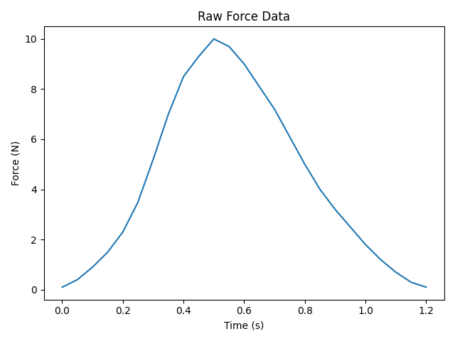
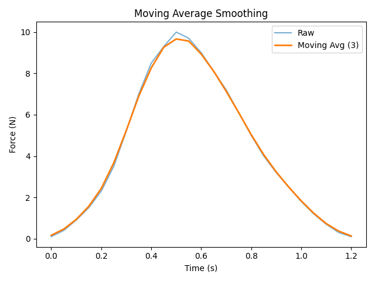
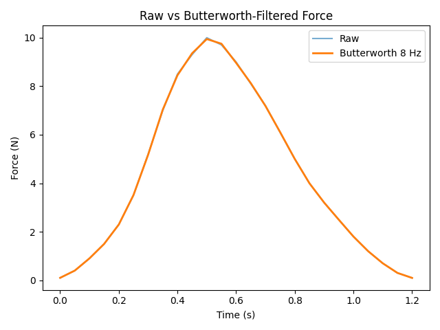
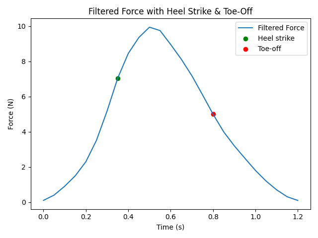

# biomechanics-signal-processing
A Python toolkit for analyzing FSR force-time data, filtering signals, and detecting gait events (heel strike & toe-off).

# WHAT IT DOES & WHY IT MATTERS
This project implements a complete force-signal processing pipeline for gait biomechanics. 
It loads FSR force-time data from CSV, applies smoothing filters (Moving Average, Butterworth), 
computes slopes, and automatically detects heel strike and toe-off events. 

This mirrors standard practice used in biomechanics research labs and wearable robotics systems.

 ## FEATURES
- Load time-series FSR force data from CSV
- Visualize raw force-time curves
- Compute slope (rate of force development)
- Moving Average smoothing
- 4th-order Butterworth low-pass filtering
- Heel strike and toe-off detection
- Plotting filtered vs raw force signals

# REPO STRUCTURE
biomechanics-signal-processing/
│
├── CSVdata/
│   └── fsr.csv
|
├── src/
│   └── force_signal_analysis.py
|
├── plots/
├── README.md
├── requirements.txt
└── .gitignore

# GENERATED GRAPHICS

### 1. Raw Force-Time Data

---

### 2. Force Slope (Rate of Change)

---

### 3. Moving Average Smoothing (Window = 3)

---

### 4. Butterworth Low-Pass Filter (8 Hz, 4th Order)

---

### 5. Heel Strike & Toe-Off Detection (Filtered Force)

# LICENSE
This project is licensed under the MIT License.

## Future Work
- Support for additional sensor types (e.g., IMU data)
- Real-time streaming or live plotting
- Automated parameter tuning for Butterworth cutoff
- Integration with control systems
